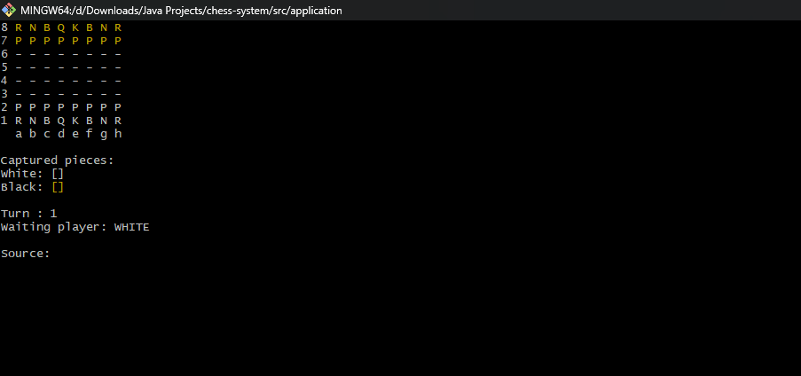
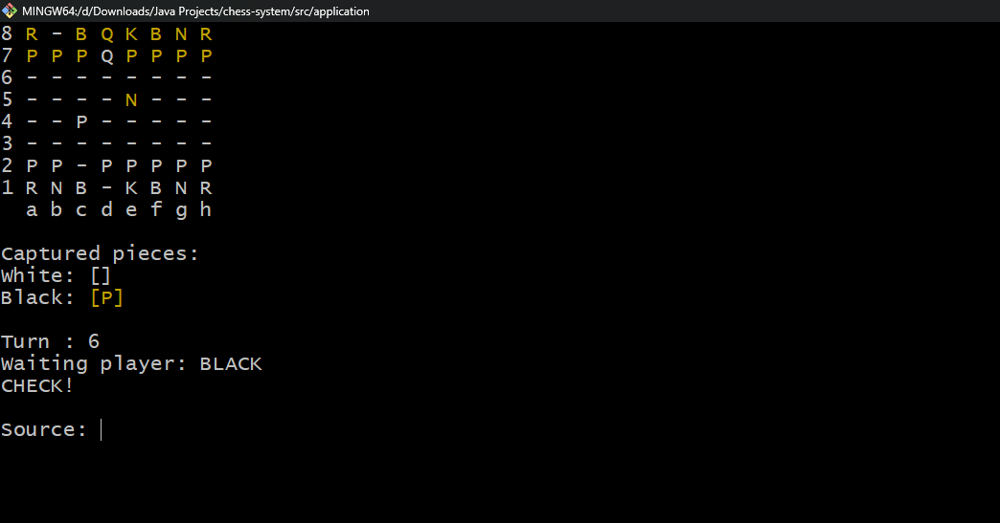
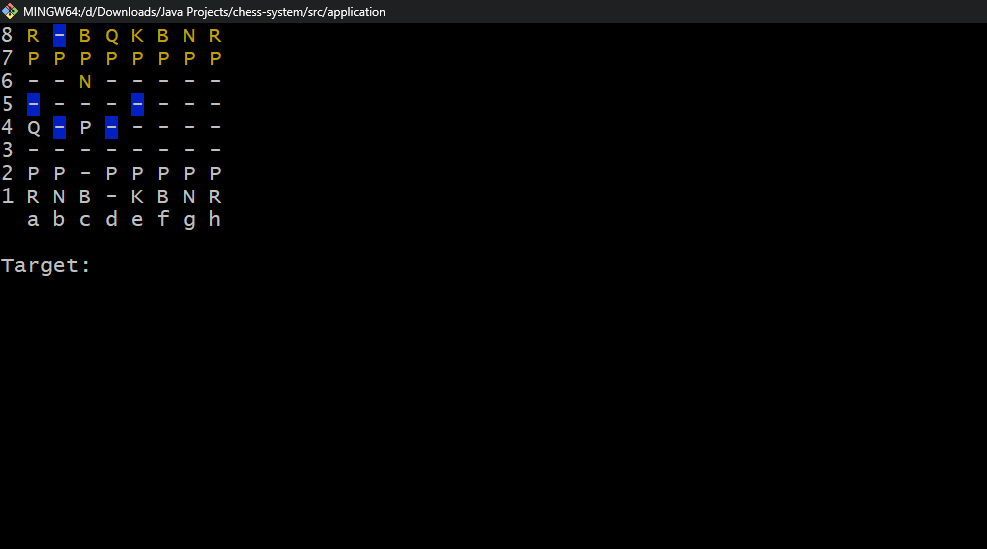

# Chess System ♟️
Um sistema completo de xadrez desenvolvido em Java, rodando no console, com foco em POO, modelagem de domínio e implementação da lógica do jogo.
O projeto foi construído passo a passo, evoluindo desde o tabuleiro básico até todos os movimentos especiais oficiais do xadrez.

---

## 🚀Tecnologias
- Java
- Programação Orientada a Objetos (POO)
- Tratamento de exceções personalizado
- Estruturas de dados
- Boas práticas de clean code

---

## 🧠 Funcionalidades

### ✔️ Movimentação completa das peças
Todas as peças implementadas com suas regras reais:
- Rei
- Rainha
- Torre
- Bispo
- Cavalo
- Peão

### ✔️ Mecânica real de uma partida
- Alternância de jogadores
- Exibição do tabuleiro no console
- Indicação de movimentos possíveis
- Captura de peças
- Contagem de movimentos
- Indicação de **check** e **checkmate**

### ✔️ Movimentos especiais implementados
- **Roque** (pequeno e grande)
- **En Passant**
- **Promoção de Peão** 

---

## 📸 Demonstração




---

## 📁 Estrutura do Projeto
```
/src
├── application/
│   ├── Main.java
│   └── UI.java
│
├── boardgame/
│   ├── Board.java
│   ├── Position.java
│   ├── Piece.java
│   └── BoardException.java
│
├── chess/
│   ├── ChessMatch.java
│   ├── ChessPiece.java
│   ├── ChessPosition.java
│   ├── ChessException.java
│   ├── Color.java
│   └── pieces/
│       ├── King.java
│       ├── Queen.java
│       ├── Rook.java
│       ├── Bishop.java
│       ├── Knight.java
│       └── Pawn.java
```
---

## ▶️ Como executar 
1. Clone o repositório:
```bash
git clone https://github.com/NatanSrsDev/Projeto-Sistema-de-Xadrez.git
```
2. Compile o projeto:
```bash
javac src/application/Main.java
```
3. Execute: 
```bash
java application.Main
```

--- 

## 📚 Aprendizados
Este projeto foi um excelente exercício para aprofundar:
- POO aplicada a um problema real
- Design de classes e regras de negócio
- Uso eficiente de exceções
- Construção de lógica de jogo complexa
- Git e versionamento na prática
- Evolução incremental de funcionalidades

---

## 🤝 Contribuições
Este projeto é didático, mas sugestões e melhorias são bem-vindas!

--- 

## 📩 Contato
**Natan — Desenvolvedor Java**
🔗 GitHub: https://github.com/NatanSrsDev
🔗 LinkedIn: https://www.linkedin.com/in/natansrs-dev/

